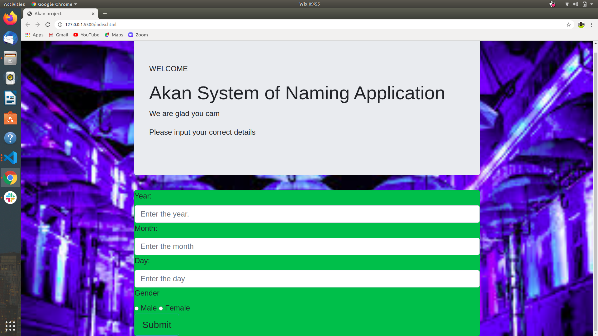

# THE AKAN NAMING SYSTEM APP
*This is an application based on the Akan naming system.

##  A SCREENSHOT OF THE PROJECT

# DESCRIPTION

This is a project that takes in a users data(i.e the users year of birth,the month of birth and the date of bith).
Then tells the user his/her Akan name.
Akan naming system is the system used to name children in Ghana.

## ACKNOWLEDGEMET
*God Almighty

*Moringa School and the entire Moringa staff

*My fellow students who assisted me in the project

## AUTHOR
*Wanzala Emmanuel John

### HOW TO GET STARTED
*On the green button written code,press the drop down menu.

*Download the zip.

*Extract the files into your desired location.

*Open the directory that you extracted the files into at the terminal.

*At the terminal:

1.For Visual Studio Code 

    -$ code .
2.For Atom

    -$ atom .
*You can now access the codes.

### BEHAVIOUR DRIVEN DEVELOPMENT(BDD)
*The page requires a user to key in details of their birthday in numbers and the user's gender.

*The application collects the data inputed.

*The user clicks on the submit button.

*The application looks for the day of the week that the user was born.

*The application displays the users name based on the Akan system of naming.

#### TECNOLOGIES USED
-HTML

-JavaScript

-CSS

-Bootstrap

#### THE LIVE LINK TO THE WEB APPLICATION
https://emmanuelwanzala.github.io/week2/

#### LICENSE
MIT LICENSE: https://spdx.org/licenses/MIT.html

#### CONTACTS

*wanzalaemmanuel28@gmail.com